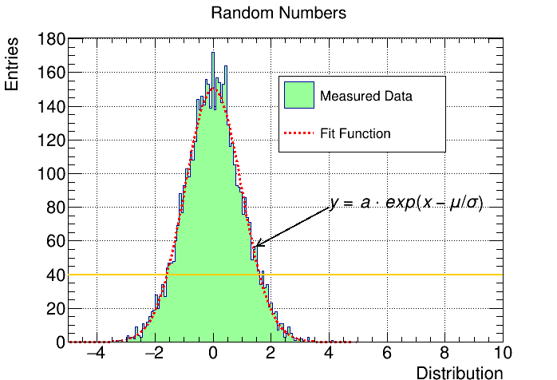
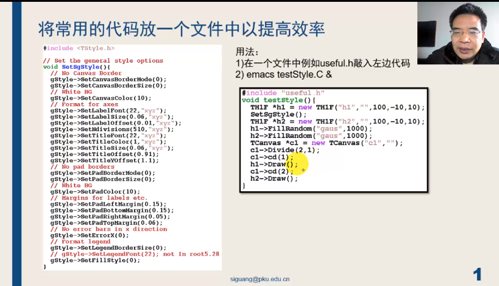
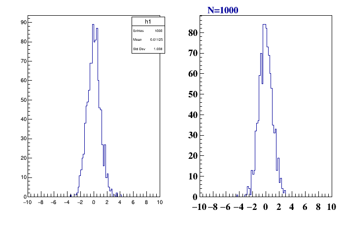
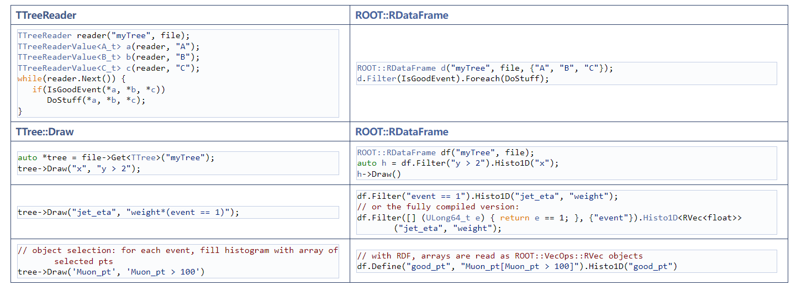

# ROOT简要知识

:fire:作者:fire:忽必烈李@bilibili

注：标数字部分基本内容，未标数字部分为优化内容

[toc]

root是用于粒子物理实验TB或PB及以上数据处理的开源软件，其他特点是数据读取与处理快，并且是一款独立的软件。

ubuntu20.04安装

```sh
$ sudo snap install root-framework
$ snap run root-framework
# or if there is no fear of conflicts with other installations:
$ root # and the output of `which root` should contain `/snap`
```


## 1. 直方图histogram

```sh
from ROOT import *

h1 =TH1F("h1","Random Numbers",200,-5,5)
h1.FillRandom("gaus")
c1=TCanvas()
h1.Draw()
#input() #显示结果
c1.Print("c1.pdf")
```


2D直方图

```c++
{

    TCanvas *c1 = new TCanvas();
    gStyle->SetPalette(kRainBow); //Palette Style 

    TH2F *hist = new TH2F("hist", "Histogram", 100, -1, 1,
                          100, -1, 1);

    hist->SetStats(0);
    TRandom *rand = new TRandom(10);

    for (int i = 0; i < 1e7; i++)

    {
        double x = rand->Gaus();
        double y = rand->Gaus();
        hist->Fill(x, y);
    }

    	
    hist->GetXaxis()->SetTitle("x [cm]");
    hist->GetYaxis()->SetTitle("y [cm]");
    hist->GetZaxis()->SetTitle("Entries");
	
    hist->Smooth();  //使得图片区域变光滑
    hist->SetContour(1000); //使得palette 变smooth

    hist->Draw("colz"); //colz surf3 cont1 lego2

    c1->Print("colz.png");
}
```


## 2. Graph

```python
from __future__ import print_function
from ROOT import TCanvas, TGraph
from ROOT import gROOT
from math import sin
from array import array


c1 = TCanvas( 'c1', 'A Simple Graph Example', 200, 10, 700, 500 )

c1.SetFillColor( 42 )
c1.SetGrid()

n = 20
x, y = array( 'd' ), array( 'd' )

for i in range( n ):
   x.append( 0.1*i )
   y.append( 10*sin( x[i]+0.2 ) )
   print(' i %i %f %f ' % (i,x[i],y[i]))

gr = TGraph( n, x, y )
gr.SetLineColor( 2 )
gr.SetLineWidth( 4 )
gr.SetMarkerColor( 4 )
gr.SetMarkerStyle( 21 )
gr.SetTitle( 'a simple graph' )
gr.GetXaxis().SetTitle( 'X title' )
gr.GetYaxis().SetTitle( 'Y title' )
gr.Draw( 'ACP' )

# TCanvas.Update() draws the frame, after which one can change it
c1.Update()
c1.GetFrame().SetFillColor( 21 )
c1.GetFrame().SetBorderSize( 12 )
c1.Modified()
c1.Update()
# If the graph does not appear, try using the "i" flag, e.g. "python3 -i graph.py"
# This will access the interactive mode after executing the script, and thereby persist
# long enough for the graph to appear.

```


array 参数的选项


errorbar

```python

from ROOT import TCanvas, TGraphErrors
from ROOT import gROOT
from array import array

c1 = TCanvas( 'c1', 'A Simple Graph with error bars', 200, 10, 700, 500 )

c1.SetGrid()
c1.GetFrame().SetFillColor( 21 )
c1.GetFrame().SetBorderSize( 12 )

n = 10
x  = array( 'f', [ -0.22, 0.05, 0.25, 0.35,  0.5, 0.61,  0.7, 0.85, 0.89, 0.95 ] )
ex = array( 'f', [  0.05,  0.1, 0.07, 0.07, 0.04, 0.05, 0.06, 0.07, 0.08, 0.05 ] )
y  = array( 'f', [     1,  2.9,  5.6,  7.4,  9.0,  9.6,  8.7,  6.3,  4.5,    1 ] )
ey = array( 'f', [  0.8,  0.7,  0.6,  0.5,  0.4,  0.4,  0.5,  0.6,  0.7,  0.8  ] )

gr = TGraphErrors( n, x, y, ex, ey )
gr.SetTitle( 'TGraphErrors Example' )
gr.SetMarkerColor( 4 )
gr.SetMarkerStyle( 21 )
gr.Draw( 'ALP' )

c1.Update()
```


```C++
{
    TCanvas *c1 = new TCanvas();
    TGraphErrors *gr = new TGraphErrors();

    fstream file;
    file.open("data3.txt", ios::in);

    double x, y, ex, ey;
    int n = 0;
    while (1)
    {
        file >> x >> y >> ex >> ey;

        n = gr->GetN();

        gr->SetPoint(n, x, y);
        gr->SetPointError(n, ex, ey);

        if (file.eof())
            break;
    }
    gr->Draw("A*");

    TF1 *fit = new TF1("fit", "pol1", 0, 100);
    gr->Fit("fit");
}
```


TGraph2D

```c++
{
    TCanvas *c = new TCanvas("c", "Graph2D example", 0, 0, 600, 400);
    Double_t x, y, z, P = 6.;
    Int_t np = 200;
    TGraph2D *dt = new TGraph2D();
    dt->SetTitle("Graph title; X axis title; Y axis title; Z axis title");
    TRandom *r = new TRandom();
    for (Int_t N = 0; N < np; N++)
    {
        x = 2 * P * (r->Rndm(N)) - P;
        y = 2 * P * (r->Rndm(N)) - P;
        z = (sin(x) / x) * (sin(y) / y) + 0.2;
        dt->SetPoint(N, x, y, z);
    }
    gStyle->SetPalette(1);
    dt->Draw("colz"); // surf1  ACONT4Z TRI1 colz

    c->Print("Graph2D.png");

    return c;
}
```


palette 可选参数

```c++
kDeepSea=51,          kGreyScale=52,    kDarkBodyRadiator=53,
kBlueYellow= 54,      kRainBow=55,      kInvertedDarkBodyRadiator=56,
kBird=57,             kCubehelix=58,    kGreenRedViolet=59,
kBlueRedYellow=60,    kOcean=61,        kColorPrintableOnGrey=62,
kAlpine=63,           kAquamarine=64,   kArmy=65,
kAtlantic=66,         kAurora=67,       kAvocado=68,
kBeach=69,            kBlackBody=70,    kBlueGreenYellow=71,
kBrownCyan=72,        kCMYK=73,         kCandy=74,
kCherry=75,           kCoffee=76,       kDarkRainBow=77,
kDarkTerrain=78,      kFall=79,         kFruitPunch=80,
kFuchsia=81,          kGreyYellow=82,   kGreenBrownTerrain=83,
kGreenPink=84,        kIsland=85,       kLake=86,
kLightTemperature=87, kLightTerrain=88, kMint=89,
kNeon=90,             kPastel=91,       kPearl=92,
kPigeon=93,           kPlum=94,         kRedBlue=95,
kRose=96,             kRust=97,         kSandyTerrain=98,
kSienna=99,           kSolar=100,       kSouthWest=101,
kStarryNight=102,     kSunset=103,      kTemperatureMap=104,
kThermometer=105,     kValentine=106,   kVisibleSpectrum=107,
kWaterMelon=108,      kCool=109,        kCopper=110,
kGistEarth=111,       kViridis=112,     kCividis=113
```

## 3.文件存储

```python
## \file
## \ingroup tutorial_pyroot
## \notebook -js
##  This program creates :
##    - a one dimensional histogram
##    - a two dimensional histogram
##    - a profile histogram
##    - a memory-resident ntuple
##
##  These objects are filled with some random numbers and saved on a file.
##
## \macro_image
## \macro_code
##
## \author Wim Lavrijsen, Enric Tejedor

from ROOT import TCanvas, TFile, TProfile, TNtuple, TH1F, TH2F
from ROOT import gROOT, gBenchmark, gRandom, gSystem
import ctypes

# Create a new canvas, and customize it.
c1 = TCanvas( 'c1', 'Dynamic Filling Example', 200, 10, 700, 500 )
c1.SetFillColor( 42 )
c1.GetFrame().SetFillColor( 21 )
c1.GetFrame().SetBorderSize( 6 )
c1.GetFrame().SetBorderMode( -1 )

# Create a new ROOT binary machine independent file.
# Note that this file may contain any kind of ROOT objects, histograms,
# pictures, graphics objects, detector geometries, tracks, events, etc..
# This file is now becoming the current directory.

hfile = gROOT.FindObject( 'py-hsimple.root' )
if hfile:
   hfile.Close()
hfile = TFile( 'py-hsimple.root', 'RECREATE', 'Demo ROOT file with histograms' )

# Create some histograms, a profile histogram and an ntuple
hpx    = TH1F( 'hpx', 'This is the px distribution', 100, -4, 4 )
hpxpy  = TH2F( 'hpxpy', 'py vs px', 40, -4, 4, 40, -4, 4 )
hprof  = TProfile( 'hprof', 'Profile of pz versus px', 100, -4, 4, 0, 20 )
ntuple = TNtuple( 'ntuple', 'Demo ntuple', 'px:py:pz:random:i' )

# Set canvas/frame attributes.
hpx.SetFillColor( 48 )

gBenchmark.Start( 'hsimple' )

# Initialize random number generator.
gRandom.SetSeed()
rannor, rndm = gRandom.Rannor, gRandom.Rndm

# For speed, bind and cache the Fill member functions,
histos = [ 'hpx', 'hpxpy', 'hprof', 'ntuple' ]
for name in histos:
   exec('%sFill = %s.Fill' % (name,name))

# Fill histograms randomly.
px_ref, py_ref = ctypes.c_double(), ctypes.c_double()
kUPDATE = 1000
for i in range( 25000 ):
 # Generate random values. Use ctypes to pass doubles by reference
   rannor( px_ref, py_ref )
 # Retrieve the generated values
   px = px_ref.value
   py = py_ref.value
   
   pz = px*px + py*py
   random = rndm(1)

 # Fill histograms.
   hpx.Fill( px )
   hpxpy.Fill( px, py )
   hprof.Fill( px, pz )
   ntuple.Fill( px, py, pz, random, i )

 # Update display every kUPDATE events.
   if i and i%kUPDATE == 0:
      if i == kUPDATE:
         hpx.Draw()

      c1.Modified()
      c1.Update()

      if gSystem.ProcessEvents():            # allow user interrupt
         break

# Destroy member functions cache.
for name in histos:
   exec('del %sFill' % name)
del histos

gBenchmark.Show( 'hsimple' )

# Save all objects in this file.
hpx.SetFillColor( 0 )
hfile.Write()
hpx.SetFillColor( 48 )
c1.Modified()
c1.Update()

# Note that the file is automatically closed when application terminates
# or when the file destructor is called.
```

## 4.数据拟合

```python
## \file
## \ingroup tutorial_pyroot
## \notebook
## Example showing how to fit in a sub-range of an histogram
## An histogram is created and filled with the bin contents and errors
## defined in the table below.
## 3 gaussians are fitted in sub-ranges of this histogram.
## A new function (a sum of 3 gaussians) is fitted on another subrange
## Note that when fitting simple functions, such as gaussians, the initial
## values of parameters are automatically computed by ROOT.
## In the more complicated case of the sum of 3 gaussians, the initial values
## of parameters must be given. In this particular case, the initial values
## are taken from the result of the individual fits.
##
## \macro_output
## \macro_code
##
## \author Wim Lavrijsen

from ROOT import TH1F, TF1
from ROOT import gROOT
from array import array

x = ( 1.913521, 1.953769, 2.347435, 2.883654, 3.493567,
      4.047560, 4.337210, 4.364347, 4.563004, 5.054247,
      5.194183, 5.380521, 5.303213, 5.384578, 5.563983,
      5.728500, 5.685752, 5.080029, 4.251809, 3.372246,
      2.207432, 1.227541, 0.8597788,0.8220503,0.8046592,
      0.7684097,0.7469761,0.8019787,0.8362375,0.8744895,
      0.9143721,0.9462768,0.9285364,0.8954604,0.8410891,
      0.7853871,0.7100883,0.6938808,0.7363682,0.7032954,
      0.6029015,0.5600163,0.7477068,1.188785, 1.938228,
      2.602717, 3.472962, 4.465014, 5.177035 )

np = len(x)
h = TH1F( 'h', 'Example of several fits in subranges', np, 85, 134 )
h.SetMaximum( 7 )

for i in range(np):
   h.SetBinContent( i+1, x[i] )

par = array( 'd', 9*[0.] )
g1 = TF1( 'g1', 'gaus',  85,  95 )
g2 = TF1( 'g2', 'gaus',  98, 108 )
g3 = TF1( 'g3', 'gaus', 110, 121 )

total = TF1( 'total', 'gaus(0)+gaus(3)+gaus(6)', 85, 125 )
total.SetLineColor( 2 )
h.Fit( g1, 'R' )
h.Fit( g2, 'R+' )
h.Fit( g3, 'R+' )

par1 = g1.GetParameters()
par2 = g2.GetParameters()
par3 = g3.GetParameters()

par[0], par[1], par[2] = par1[0], par1[1], par1[2]
par[3], par[4], par[5] = par2[0], par2[1], par2[2]
par[6], par[7], par[8] = par3[0], par3[1], par3[2]

total.SetParameters( par )
h.Fit( total, 'R+' )

```


数据拟合函数参数含义：


## 5. 绘图美化

```C++
{
    TH1F *hist = new TH1F("hist", "Random Numbers", 200, -5, 10);
    hist->FillRandom("gaus");

    hist->SetFillColor(kGreen - 9);

    hist->GetXaxis()->SetTitle("Distribution");
    hist->GetYaxis()->SetTitle("Entries");

    hist->GetXaxis()->SetTitleSize(0.05);
    hist->GetYaxis()->SetTitleSize(0.05);
    hist->GetXaxis()->SetLabelSize(0.05);
    hist->GetYaxis()->SetLabelSize(0.05);

    TF1 *fit = new TF1("fit", "gaus", -5, 5);
    fit->SetLineWidth(3);
    // fit->SetLineColor (kBlue) ;
    fit->SetLineStyle(2);

    fit->SetParameter(0, 40);
    fit->SetParameter(1, 5);
    fit->SetParameter(2, 1);

    TCanvas *c1 = new TCanvas();
    c1->SetTickx();
    c1->SetTicky();
    c1->SetGridx();
    c1->SetGridy();

    //hist
    hist->SetStats(0);
    hist->Draw();
    //fit
    hist->Fit("fit", "R");

    // 图例
    TLegend *leg = new TLegend(0.5, 0.6, 0.8, 0.8);
    leg->SetBorderSize(1);

    leg->AddEntry(hist, "Measured Data", "f");
    leg->AddEntry(fit, "Fit Function", "L");
    leg->Draw();

    double mean = fit->GetParameter(1);
    double sigma = fit->GetParameter(2);
    cout << mean / sigma << endl;

    //添加线条
    TLine *l1 = new TLine(-5,40,10,40);
    l1->SetLineWidth(2);
    l1->SetLineColor(kOrange);
    l1->Draw();
    
    //添加箭头及文字
    double x0 =1.5;
    int bin = hist->FindBin(x0);
    double y0 = hist->GetBinContent(bin);

    TArrow *arr = new TArrow(4,80,x0,y0);
    arr->SetLineWidth(2);
    arr->SetArrowSize(0.02);
    arr->Draw();

    TLatex *t = new TLatex(4,80,"y=a\\cdot exp(x-\\mu/\\sigma)");
    t->Draw();
}
```



## ogl绘制3D图

```c++
{
TCanvas *cl = new TCanvas();
TGLViewer *view = (TGLViewer*)gPad->GetViewer3D();
TGeoManager *man = new TGeoManager();
TGeoVolume *top = man->MakeBox("TOP", NULL, 10, 10, 10);
TGeoVolume *box = man->MakeBox("BOX", NULL, 1, 1, 0.2);
box->SetLineColor(kGreen) ;
TGeoHMatrix *trans_rot = new TGeoHMatrix("TRANSROT");
trans_rot->RotateX(45.);
trans_rot->SetDz(2.);
TGeoVolume *tube = man->MakeTube( "TUBE",NULL, 0.5, 1.0, 1.0);
man->SetTopVolume(top) ;

top->AddNode(box, 0);
top->AddNode(box, 1, trans_rot);
top->AddNode(tube,2);

man->CloseGeometry () ;

top->Draw("ogl");

TPolyLine3D *l = new TPolyLine3D();
l->SetLineColor(kRed);
l->SetPoint(0,0,0,0);
l->SetPoint(1,1,1,1);
l->SetPoint(2,0,0,2);
l->Draw("same");
} 
```

结果图


## 寻找函数的根

```c++
{
    TF1 *f = new TF1("f", "[0]*cos([1]+x)", -5, 5);

    f->SetParameter(0, 1);
    f->SetParameter(1, 1);

    TCanvas *cl = new TCanvas();
    f->Draw();

    ROOT::Math::RootFinder finder;

    finder.Solve(*f, -5, 0);
    double solution = finder.Root();
    cout << solution << endl;

    finder.Solve(*f, 0, 2);
    double solution2 = finder.Root();
    cout << solution2 << endl;

    finder.Solve(*f, 2, 5);
    double solution3 = finder.Root();
    cout << solution3 << endl;

    TLine *l1 = new TLine(-5, 0, 5, 0);
    TLine *l2 = new TLine(solution, -2., solution, 2);
    TLine *l3 = new TLine(solution2, -2., solution2, 2);
    TLine *l4 = new TLine(solution3, -1., solution3, 1);

    l1->Draw();
    l2->Draw();
    l3->Draw();
    l4->Draw();
}
```


## 绘制动画

```c++
{
    TCanvas *c1 = new TCanvas("c1", "c1", 300, 300);
    TEllipse *el = new TEllipse(0.5, 0.5, 0.1, 0.1);
    el->SetFillColor(kBlack);
    gSystem->Unlink("tut28.gif");

    for (int i = 0; i < 50; i++)
    {
        el->SetX1(0.5 + i * 0.01);
        el->Draw();
        c1->Update();
        c1->Print("tut28.gif+");
        // sleep(1);
    }
}
```


绘图动画

```C++
{
    TCanvas *cl = new TCanvas();

    TH1F *hist = new TH1F("hist", "Histogram", 100, -5, 5);

    gSystem->Unlink("tut29.gif");
    TRandom *r1 = new TRandom();

    for (int i = 0; i < 1e3; i++)
    {
        double val = r1->Gaus();
        hist->Fill(val);
        hist->Draw();
        hist->Fit("gaus");
        cl->Modified();
        cl->Update();
        if (i % 100 == 0)
            cl->Print("tut29.gif+");
        // sleep(1);
    }
}
```


## TVector3

```c++
{
    TVector3 v1(1, 2, 3);

    cout << v1.Y() << endl;
    cout << v1[2] << endl;

    v1.Print();

    double rho = v1.Mag();
    double theta = v1.Theta() * 180. / TMath :: Pi();
    double phi = v1.Phi();

    cout << rho << "\t" << theta << "\t" << phi << endl;
    v1.RotateZ(90 * TMath::Pi() / 180.);
    v1.Print();

    TVector3 v2;

    v2.SetX(4);
    v2.SetY(5);
    v2.SetZ(6);
    v2.Print();

    TVector3 v3;

    v3.SetZ(10);
    v3.SetTheta(10 * TMath ::Pi() / 180.);
    v3.SetPhi(45 * TMath ::Pi() / 180.);
    v3.Print();

    TVector3 v4=v1+v2;
    v4.Print();
    
    cout<<v1.Dot(v2)<<endl; //向量点乘
    cout<<v1.Angle(v2)*180./TMath::Pi()<<endl; //计算向量夹角

}
```


## TClonesArray

TClonesArray用于解决频繁的new 与delete占用数据处理时间问题，clonesArray处理重复利用内存问题

```c++
void write()
{
    TClonesArray *arr = new TClonesArray("TVector3");
    TClonesArray &ar = *arr;
    TFile *file = new TFile("file.root", "recreate");
    TTree *tree = new TTree("tcl", "tcl");
    tree->Branch("array_branch", &arr);
    TRandom2 *rand = new TRandom2(1);
    for (int i = 0; i < 100; i++)
    {
        /* code */
        arr->Clear();
        for (int j = 0; j < 1000; j++)
        {
            /* code */
            double x = rand->Rndm();
            double y = rand->Rndm();
            double z = rand->Rndm();

            new (ar[j]) TVector3(x, y, z);
        }

        tree->Fill();
    }
    file->Write();
    file->Close();
}

void read()
{
    TFile *file = new TFile("file.root");
    TTree *tree = (TTree*)file->Get("tcl");
    TClonesArray *arr = new TClonesArray("TVector3");
    tree->SetBranchAddress("array_branch",&arr);
    int entries = tree->GetEntries();
    for (int i = 0; i < entries; i++)
    {
        /* code */
        tree->GetEntry(i);
        int lines = arr->GetEntries();
        for (int j = 0; j < lines; j++)
        {
            /* code */
            TVector3 *vec = (TVector3*)arr->At(j);
            cout<<vec->X()<<endl;

        }
        
    }
    
}

void tut29()
{
    write();
    read();
}
```

## THStack

THStack能解决多直方图放到一个途中，y轴不自动变化的问题

```c++
{
    THStack *hstack = new THStack("hstack", "Histogram Stack;x title;y title");

    TH1F *hist = new TH1F("hist", "Histogram;x title;y title", 100, -10, 10);
    TH1F *hist2 = new TH1F("hist2", "Histogram 2;x title;y title", 100, -10, 10);

    hstack->Add(hist);
    hstack->Add(hist2);

    hist->FillRandom("gaus", 1e4);
    hist2->FillRandom("gaus", 1e5);

    TCanvas *c2 = new TCanvas();
    c2->Divide(1,2);
    c2->cd(1);
    hist->Draw();
    hist2->Draw("same");
    c2->cd(2);
    hstack->Draw("nostack");
    
    c2->Print("hstack.png");
}
```


## 使用参数输入

编写数据处理程序

```c++
void processData(TString filename)
{
    TFile *file = new TFile(filename);
}
```

在终端传入参数给该处理程序

```sh
root processData.C("test.root")
```

## TChain

批量处理ROOT程序，批处理的文件数据格式必须一致。

```c++

void write(TString filename)
{
    TFile *output = new TFile(filename, "recreate");
    TTree *tree = new TTree("tree", "tree");
    double x, y;
    tree->Branch("x", &x, "x/D");
    tree->Branch("y", &y, "y/D");

    TRandom2 *r = new TRandom2();
    for (int i = 0; i < 1e6; i++)
    {
        x = 1 + r->Rndm() * 9;
        y = x * 2;
        tree->Fill();
    }
    output->Write();

    output->Close();
}

void chain()
{
    TChain *ch1 = new TChain("tree");  //连接root中的树
    
    ch1->Add("tuta.root");
    ch1->Add("tutb.root");

    double x;
    ch1->SetBranchAddress("x",&x);

    int entries = ch1->GetEntries();
    TH1F *hist = new TH1F("hist","Histogram",100,1,10);
    for (int i = 0; i < entries; i++)
    {
        /* code */
        ch1->GetEntry(i);
        hist->Fill(x);
    }
    TCanvas *c1 = new TCanvas();
    hist->Draw();
}

void tut29()
{
    write("tuta.root");
    write("tutb.root");

    chain();
}
```

## TCut用于TTree分析

当文件比较大时，可以采用TCut做简单的分析测试

```c++
void write(TString filename)
{
    TFile *output = new TFile(filename, "recreate");
    TTree *tree = new TTree("tree", "tree");
    double x, y;
    tree->Branch("x", &x, "x/D");
    tree->Branch("y", &y, "y/D");

    TRandom2 *r = new TRandom2();
    for (int i = 0; i < 1e6; i++)
    {
        x = 1 + r->Rndm() * 9;
        y = x * 2;
        tree->Fill();
    }
    output->Write();

    output->Close();
}

void cut()
{
    TCut cut1 = "x<5";  //设置截断条件
	TCut cut2 = "x>7";
	TFile *input = new TFile("tuta.root","read");
    TTree *tree = (TTree*)input->Get("tree");
	tree->Draw("y",cut1||cut2);
}

void tut29()
{
    write("tuta.root");
    cut();
}
```


## TProfile 绘制直方图

TProfile绘制的直方图与TH1不同，TProfile填充的是Fill(x,y),而TH1只填充Fill(x)，y是填充的频率。

TProfile  Fill(x,y1)、Fill(x,y2)同一x,不同的y，直方图将采用 
$$
(x,\overline y \pm \delta)
$$

$\delta$ 表示方差，只有在 “S”参数使用是，errorbar的长度才等于$\delta$

```c++
{
    TCanvas *c1 = new TCanvas();
    TProfile *hprof = new TProfile("hprof", "Profile", 100, 0, 10, "S"); //注意参数S
    TRandom2 *rnd = new TRandom2();
    for (int i = 0; i < 1000; i++)
    {
        hprof->Fill(1, rnd->Rndm());
    }
    hprof->Draw();
}
```


！！！TProfile能够对多组数据进行直接求方差

## 编译ROOT代码

```c++
#include "TStopwatch.h"
#include "TRandom2.h"
#include "iostream"
using namespace std;

void tut()
{
    TStopwatch t;
    TRandom2 *r = new TRandom2();
    double x=0;
    for(int i=0;i<1e9;i++)
        x +=r->Rndm()
    cout<<x<<endl;
    t.Print();//显示程序运行耗时
}
```

编译,产生库文件；下次运行能缩短编译时间

```sh
root tut.C+ 
```

## 透明图像的绘制

```c++
//void transparency()
{
   auto c1 = new TCanvas("c1", "c1",224,330,700,527);
   c1->Range(-0.125,-0.125,1.125,1.125);
 
   auto tex = new TLatex(0.06303724,0.0194223,"This text is opaque and this line is transparent");
   tex->SetLineWidth(2);
   tex->Draw();
 
   auto arrow = new TArrow(0.5555158,0.07171314,0.8939828,0.6195219,0.05,"|>");
   arrow->SetLineWidth(4);
   arrow->SetAngle(30);
   arrow->Draw();
 
   // Draw a transparent graph.
   Double_t x[10] = {
   0.5232808, 0.8724928, 0.9280086, 0.7059456, 0.7399714,
   0.4659742, 0.8241404, 0.4838825, 0.7936963, 0.743553};
   Double_t y[10] = {
   0.7290837, 0.9631474, 0.4775896, 0.6494024, 0.3555777,
   0.622012, 0.7938247, 0.9482072, 0.3904382, 0.2410359};
   auto graph = new TGraph(10,x,y);
   graph->SetLineColorAlpha(46, 0.1);
   graph->SetLineWidth(7);
   graph->Draw("l");
 
   // Draw an ellipse with opaque colors.
   auto ellipse = new TEllipse(0.1740688,0.8352632,0.1518625,0.1010526,0,360,0);
   ellipse->SetFillColor(30);
   ellipse->SetLineColor(51);
   ellipse->SetLineWidth(3);
   ellipse->Draw();
 
   // Draw an ellipse with transparent colors, above the previous one.
   ellipse = new TEllipse(0.2985315,0.7092105,0.1566977,0.1868421,0,360,0);
   ellipse->SetFillColorAlpha(9, 0.571);
   ellipse->SetLineColorAlpha(8, 0.464);
   ellipse->SetLineWidth(3);
   ellipse->Draw();
 
   // Draw a transparent blue text.
   tex = new TLatex(0.04871059,0.1837649,"This text is transparent");
   tex->SetTextColorAlpha(9, 0.476);
   tex->SetTextSize(0.125);
   tex->SetTextAngle(26.0);
   tex->Draw();
 
   // Draw two transparent markers
   auto marker = new TMarker(0.03080229,0.998008,20);
   marker->SetMarkerColorAlpha(2, .3);
   marker->SetMarkerStyle(20);
   marker->SetMarkerSize(1.7);
   marker->Draw();
   marker = new TMarker(0.1239255,0.8635458,20);
   marker->SetMarkerColorAlpha(2, .2);
   marker->SetMarkerStyle(20);
   marker->SetMarkerSize(1.7);
   marker->Draw();
 
   // Draw an opaque marker
   marker = new TMarker(0.3047994,0.6344622,20);
   marker->SetMarkerColor(2);
   marker->SetMarkerStyle(20);
   marker->SetMarkerSize(1.7);
   marker->Draw();
    
   c1->Print("transparency.pdf");
}
```

窗口显示出错，存为pdf显示正常，采用ghostscript将pdf转换为png

```sh
gs -dSAFER -r600 -sDEVICE=pngalpha -o transparency.png transparency.pdf
```


## :house:自动设置直方图palette颜色

使用palette的选项卡，`PFC `(Palette Fill Color), `PLC` (Palette Line Color) and `PMC` (Palette Marker Color). When one of these options is given to `TH1::Draw` the histogram get its color from the current color palette defined by `gStyle->SetPalette(...)`. The color is determined according to the number of objects having palette coloring in the current pad.

```c++
/// \file
/// \ingroup tutorial_hist
/// \notebook
/// Palette coloring for histogram is activated thanks to the options `PFC`
/// (Palette Fill Color), `PLC` (Palette Line Color) and `PMC` (Palette Marker Color).
/// When one of these options is given to `TH1::Draw` the histogram get its color
/// from the current color palette defined by `gStyle->SetPalette(...)`. The color
/// is determined according to the number of objects having palette coloring in
/// the current pad.
///
/// In this example five histograms are displayed with palette coloring for lines and
/// and marker. The histograms are drawn with makers and error bars and one can see
/// the color of each histogram is picked inside the default palette `kBird`.
///
/// \macro_image
/// \macro_code
///
/// \author Olivier Couet

void histpalettecolor()
{
   auto C = new TCanvas();

   gStyle->SetOptTitle(kFALSE);
   gStyle->SetOptStat(0);

   auto h1 = new TH1F ("h1","Histogram drawn with full circles",100,-4,4);
   auto h2 = new TH1F ("h2","Histogram drawn with full squares",100,-4,4);
   auto h3 = new TH1F ("h3","Histogram drawn with full triangles up",100,-4,4);
   auto h4 = new TH1F ("h4","Histogram drawn with full triangles down",100,-4,4);
   auto h5 = new TH1F ("h5","Histogram drawn with empty circles",100,-4,4);

   TRandom3 rng;
   Double_t px,py;
   for (Int_t i = 0; i < 25000; i++) {
      rng.Rannor(px,py);
      h1->Fill(px,10.);
      h2->Fill(px, 8.);
      h3->Fill(px, 6.);
      h4->Fill(px, 4.);
      h5->Fill(px, 2.);
   }

   h1->SetMarkerStyle(kFullCircle);
   h2->SetMarkerStyle(kFullSquare);
   h3->SetMarkerStyle(kFullTriangleUp);
   h4->SetMarkerStyle(kFullTriangleDown);
   h5->SetMarkerStyle(kOpenCircle);

   h1->Draw("PLC PMC");  //`PFC` (Palette Fill Color), `PLC` (Palette Line Color) and `PMC` (Palette Marker Color).
   h2->Draw("SAME PLC PMC"); 
   h3->Draw("SAME PLC PMC");
   h4->Draw("SAME PLC PMC");
   h5->Draw("SAME PLC PMC");

   gPad->BuildLegend();
}

```


## 如何查看root演示案例

下载root 源文件，解压获得tutorial文件。分别采用python和c++运行root 的demo， 点开Browser查看案例演示及源代码。


**方法1：**

进入tutorial中的pyroot文件夹，运行

```python
pyroot demo.py
```

**方法2：**

进入tutorial文件夹，运行

```c++
root demos.C
```

## 如何设置自己的root模板

**1.rootlogon.C** 

文件路径：$ROOTSYS/tutorials/rootlogon.C 

rootlogon.C文件在root启动的当前目录下会被自动调用执行，进行满足用户的特殊配置要求。例如，导入自己的库，设置自己绘图样式

**a. 导入自己编译的库**

想要导入自己的库函数，在rootlogon.C文件内可加入

```c++
gSystem->Load("xxx.so")
```

**b. 设置自己的绘图样式**

```c++
// This is the file rootlogon.c
{
TStyle *mystyle = new TStyle("MyStyle","My Root Styles");
 
// from ROOT plain style
myStyle->SetCanvasBorderMode (0) ;
myStyle->SetPadBorderMode (0) ;
myStyle—>SetPadcolor (0) ;
myStyle->SetCanvasColor (0) ;
myStyle->SetTitleColor (1) ;
myStyle->SetStatcolor (0) ;
myStyle->SetLabelSize(0.03,"xyz"); // size of axis values

// default canvas positioning
myStyle->setCanvasDefX (900) ;
myStyle—>SetCanvasDefY (20) ;
myStyle->setCanvasDefH (550) ;
myStyle->setCanvasDefW(540) ;

myStyle->SetPadBottomMargin (0.1) ;
myStyle->SetPadTopMargin (0.1) ;
myStyle—>setPadLeftMargin (0.1) ;
myStyle—>SetPadRightMargin (0.1) ;
myStyle->SetPadTickX (1);
myStyle—>SetPadTickY (1) ;
myStyle—>SetFrameBorderMode (0) ;

// Din letter
myStyle->SetPaperSize(21, 28);//show overflow and underflow
myStyle->SetOptStat(111111);
myStyle->SetOptFit(1011);
myStyle->SetPalette(1);

//apply the new style
gROOT->SetStyle("MyStyle"); //uncomment to set this style
gROOT->ForceStyle(); //use this style,not the one saved in root files
printf("\n Beginning new ROOT session with private TStyle \n");

}
```


**2. 将常用代码放到一个文件中以提高效率**

将常用文件放到一个文件中，如`useful.h`



`useful.h`文件：

```c++
#include <TStyle.h>
// Set the general style options
void SetSgStyle()
{
    // No Canvas Border
    gStyle->SetCanvasBorderMode(0);
    gStyle->SetCanvasBorderSize(0);
    // White BG
    gStyle->SetCanvasColor(10);
    // Format for axes
    gStyle->SetLabelFont(22, "xyz");
    gStyle->SetLabelSize(0.06, "xyz");
    gStyle->SetLabelOffset(0.01, "xyz");
    gStyle->SetNdivisions(510, "xyz");
    gStyle->SetTitleFont(22, "xyz");
    gStyle->SetTitleColor(1, "xyz");
    gStyle->SetTitleSize(0.06, "xyz");
    gStyle->SetTitleOffset(0.91);
    gStyle->SetTitleYOffset(1.1);
    // No pad borders
    gStyle-> SetPadBorderMode(0);
    gStyle->SetPadBorderSize(0);
    // White BG
    gStyle->SetPadColor(10);
    // Margins for labels etc.
    gStyle->SetPadLeftMargin(0.15);
    gStyle->SetPadBottomMargin(0.15);
    gStyle->SetPadRightMargin(0.05);
    gStyle->SetPadTopMargin(0.06);
    // No error bars in x direction
    gStyle->SetErrorX(0);
    // Format legend
    gStyle->SetLegendBorderSize(0);
    gStyle->SetFillStyle(0);
}
```

在`useful.h`中加入：

```c++
// 设置Latex放置位置（x0,y0）,直方图，字符串，字体大小
void txtN(Double_t x0, Double_t y0, TH1 *h, Char_t sName[] = "N=%.0f", Double_t sizeTxt = 0.06)
{
    h->SetStats(kFALSE);
    TLatex *ltx = new TLatex();
    ltx->SetNDC(kTRUE);
    ltx->SetTextColor(h->GetLineColor());
    ltx->SetTextFont(22);
    ltx->SetTextSize(sizeTxt);
    ltx->DrawLatex(x0, y0, Form(sName, h->GetEntries()));
    gPad->Modified();
    gPad->Update();
}
```

`testStyle.C`文件：

```c++
#include "useful.h"
void testStyle()
{
    TH1F *h1 = new TH1F("h1","",100,-10,10);
    SetSgStyle();
    TH1F *h2 = new TH1F("h2","",100,-10,10);
    h1->FillRandom("gaus",1000);
    h2->FillRandom("gaus",1000);
    TCanvas *c1 = new TCanvas("c1","");
    c1->Divide(2,1);
    c1->cd(1);
    h1->Draw();
    c1->cd(2);
    h2->Draw();
    txtN(0.2,0.95,h2);// 自定义格式
}
```



在`useful.h`中加入：

```c++
// hist名称，bin宽度，bin上下限，设置MeV标题，设置Mark样式
TH1F * newTH1F(Char_t name[]="h1",Double_t binw=0.01, Double_t LowBin=0.0,Double_t HighBin=3.0,Bool_t MevTitle=kTRUE,Int_t iMode=-1)
{
    Int_t nbin = TMath::Nint((HighBin-LowBin)/binw);
    HighBin = binw*nbin + LowBin;
    
    TH1F *h = new TH1F(name,"",nbin,LowBin,HighBin);
    if(MevTitle)
        h->GetYaxis->SetTitle(Form("Events/(%.0fMeV/c^{2})",h->GetBinWidth(1)*1000));
    h->SetMinimum(0.0);
    h->GetYaxis()->SetTitleOffset(1.1);
    if(iMode>=0&&iMode<14){
        Int_t iMarker[] ={20,21,24,25,28,29,30,27,3,5,2,,26,22,23};
        Int_t iColor[]={2,4,6,9,1,50,40,31,41,35,44,38,47,12};
        h->SetMarkerStyle(iMarker[iMode]);
        h->SetMarkerColor(iColor[iMode]);
        h->SetLineColor(iColor[iMode]);
    }
    return h;
}
// LineX1： 线的位置，颜色，宽度
void LineX1(Double_t atX, Int_t iColor=kRed, Int_t iStyle=1,Double_t iWidth=1)
{
    gPad->Modified();
    gPad->Update();
    TLine *l1 = new TLine(atX,gPad->GetUymin(),gPad->GetUymax());
    l1->SetLineColor(iColor);
    l1->SetLineStyle(iStyle);
    l1->SetLineWidth(iWidth);
    l1->Draw();
}
```

使用案例，`testStyle2`

```c++
#include "useful.h"
void testStyle2()
{
    TH1F *h1 = newTH1F("h1",0.5,-10,10,kTRUE,1);
    SetSgStyle();
    TH1F *h2 = newTH1F("h2",0.5,-10,10,kTRUE,2);
    h1->FillRandom("gaus",1000);
    h2->FillRandom("gaus",1000);
    TCanvas *c1 = new TCanvas("c1","");
    c1->Divide(2,1);
    c1->cd(1);
    h1->Draw("EP");
    c1->cd(2);
    h2->Draw("EP");
    txtN(0.2,0.95,h2);
    LineX1(0.0);
}
```


王思广老师的模板：[CommonCUtsPureROOT.h](CommonCutsPureROOT.h)

## 不同尺度左右轴直方图叠加

以下脚本创建两个直方图；第二直方图是第一直方图的bins积分。它显示了在同一个Pad中绘制两个直方图的过程，并使用右侧的新垂直轴绘制第二个直方图横坐标。

```c++
void twoscales() {
   TCanvas *c1 = new TCanvas("c1","different scales hists",600,400);
   //create, fill and draw h1
   gStyle->SetOptStat(kFALSE);
   TH1F *h1 = new TH1F("h1","my histogram",100,-3,3);
   for (Int_t i=0;i<10000;i++) h1->Fill(gRandom->Gaus(0,1));
   h1->Draw();
   c1->Update();
   //create hint1 filled with the bins integral of h1
   TH1F *hint1 = new TH1F("hint1","h1 bins integral",100,-3,3);
   Float_t sum = 0;
   for (Int_t i=1;i<=100;i++) {
      sum += h1->GetBinContent(i);
      hint1->SetBinContent(i,sum);
   }
   //scale hint1 to the pad coordinates
   Float_t rightmax = 1.1*hint1->GetMaximum();
   Float_t scale    = gPad->GetUymax()/rightmax;
   hint1->SetLineColor(kRed);
   hint1->Scale(scale);
   hint1->Draw("same");
   //draw an axis on the right side
   TGaxis*axis = new TGaxis(gPad->GetUxmax(),gPad->GetUymin(),
                            gPad->GetUxmax(),gPad->GetUymax(),
                            0,rightmax,510,"+L");
   axis->SetLineColor(kRed);
   axis->SetLabelColor(kRed);
   axis->Draw();
}
```


## 如何设置Y轴科学计数

关键代码：

```c++
// force sceintific notation 
TGaxis::SetMaxDigits(3);
```

案例：

```c++
#include <Riostream.h>
#include <vector.h>

#include "TROOT.h"
#include "TMultiGraph.h"
#include "TFile.h"
#include "TAxis.h"
#include "TCanvas.h"
#include "TGraph.h"
#include "TObjString.h"
#include "TString.h"

void test()
{ 
  std::vector<Int_t>    yIndices1;
  std::vector<Int_t>    yIndices2;
  std::vector<Double_t> xValues;
  std::vector<TString>  yTitres;

  TString line;
  TString lastLine;
  Int_t vdate[3];
  char delimiters[] = " \t\n;";
  char varexp[10];

  //========================== User data =====================================//
  //;input file
/*
  TString iDRun = "MOD3D";
  TString iDir ="./";
  TString initFile = iDir+iDRun+"_InitialParameters.dat";
  TString file1    = iDir+iDRun+"_MPVPar_Sud.dat";
  TString file2    = iDir+iDRun+"_MPAlt_Sud.dat";
*/
  // number of columns in input file
  const Int_t nc1 = 29; // file1
  const Int_t nc2 = 29; // file2

  // indices of columns to plot (0 is first column); Titles of columns to plot 
  yIndices1.push_back( 7); yIndices2.push_back(-1); yTitres.push_back("Bz");
  yIndices1.push_back( 8); yIndices2.push_back(-1); yTitres.push_back("E");
  yIndices1.push_back(21); yIndices2.push_back(21); yTitres.push_back("Bo");
  yIndices1.push_back( 6); yIndices2.push_back( 6); yTitres.push_back("Bm");
  yIndices1.push_back( 1); yIndices2.push_back( 1); yTitres.push_back("h");
  yIndices1.push_back( 2); yIndices2.push_back( 2); yTitres.push_back("Latitude");
  yIndices1.push_back(18); yIndices2.push_back(18); yTitres.push_back("Lm");
  yIndices1.push_back(17); yIndices2.push_back(17); yTitres.push_back("L*");
  yIndices1.push_back(27); yIndices2.push_back(27); yTitres.push_back("K");
  yIndices1.push_back(19); yIndices2.push_back(19); yTitres.push_back("Arc");
  yIndices1.push_back(23); yIndices2.push_back(23); yTitres.push_back("Stormer Cst.");

  // Set the number of graphs
  const Int_t ng = 11;
  Int_t xIndice = 4; // Column must be in file1
  TString xTitre("Longitude"); // Common x title

  //======================End User data ======================================//

  TGraph *tGraph1 = new TGraph[ng];
  TGraph *tGraph2 = new TGraph[ng];
  TMultiGraph *mg = new TMultiGraph[ng];
  // force sceintific notation 
  TGaxis::SetMaxDigits(3);
/*
  // === Get Date in init parameter file ======================================
  ifstream stream1(initFile.Data());
  if (!stream1.is_open())
  { cout << "error opening stream1 "<< initFile << endl;
    return;
  }
  while(!line.ReadLine(stream1).eof()) // Get last line with date information
  { lastLine = line; }
  stream1.close();

  TObjArray* Strings = lastLine.Tokenize(delimiters); // Separate blanks
  TIter iString(Strings);
  TObjString* os=0;
  for(Int_t i=0;i<3;i++)
  { os=(TObjString*)iString();
    vdate[i] = os->GetString().Atoi();
  }
  delete Strings;
  char date[11];
  sprintf(date,"Date %d/%02d/%02d",vdate[0],vdate[1],vdate[2]);

  cout << date <<endl;

  //== Read data from ASCII files into graphs =================================

  //== file1
  Double_t v1[nc1]; // store data from a line
  ifstream stream2(file1.Data());
  if (!stream2.is_open())
  { cout << "error opening stream2 "<< initFile << endl;
    return;
  }
  cout << "reading stream2 "<<file1<<endl;
  Int_t nl = 0;
  while (!line.ReadLine(stream2).eof()) // assumes empty line at eof!
  { TObjArray* Strings = line.Tokenize(delimiters);
    if(Strings->GetEntriesFast())
    { TIter iString(Strings);
      TObjString* os=0;
      Int_t j=0;
      while ((os=(TObjString*)iString()))
      { v1[j] = os->GetString().Atof();
	if (j == xIndice) { xValues.push_back(v1[j]); }
	j++;
      }
      for(Int_t i=0;i<ng;i++)
      { if(yIndices1[i] >= 0)
        { tGraph1[i].SetPoint(nl,xValues[nl],v1[yIndices1[i]]); }
      }
      nl++;
    }
    delete Strings;
  }
  stream2.close();

  //== file2
  Double_t v2[nc2];
  ifstream stream3(file2.Data());
  if (!stream3.is_open())
  { cout << "error opening stream3 "<< initFile << endl;
    return;
  }
  cout << "reading stream3 "<<file2<<endl;
  nl=0;
  while (!line.ReadLine(stream3).eof()) // assumes empty line at eof!
  { TObjArray* Strings = line.Tokenize(delimiters);
    if(Strings->GetEntriesFast())
    { TIter iString(Strings);
      TObjString* os=0;
      Int_t j=0;
      while ((os=(TObjString*)iString()))
      { v2[j++] = os->GetString().Atof(); }
      for(Int_t i=0;i<ng;i++)
      { if(yIndices2[i] >= 0)
        { tGraph2[i].SetPoint(nl,xValues[nl],v2[yIndices2[i]]); }
      }
      nl++;
    }
    delete Strings;
  }
  stream3.close();
*/

  //== Generate Graphs for test ================================================
  Double_t cnst[] = {0,10,100,1000,-10000,100000,1000000,
                    1000000,10000000,100000000,100000000000};
  for (Int_t n=0;n<100;n++)
  { Double_t x = n*0.1;
    for (Int_t i=0;i<ng;i++)
    { Double_t y = cnst[i]+sin(x);
      tGraph1[i].SetPoint(n,x,cnst[i]);
      tGraph2[i].SetPoint(n,x,y);
    }
  }
  
  //== Draw Multiple Graphs ====================================================
  // Create a new canvas (window) to plot graphs.
  TCanvas *c1 = new TCanvas("c1","Trajectories",0,0,800,950);
  c1->SetFillColor(0);
  gPad->SetLeftMargin(0.1);
  gPad->SetRightMargin(0.001);
  gPad->SetBottomMargin(0.3);
  gPad->SetFrameFillColor(0);
  gPad->SetFrameFillStyle(4000);
  gPad->SetFrameBorderSize(0);
  gPad->SetFrameBorderMode(0);
  // Divide to create multiple graphs with common X axis
  c1->Divide(1,ng,10.5,0);

  gPad->SetBottomMargin(0.3);
  for (Int_t i=0;i<ng;i++)
  { c1->cd(i+1);
    cout << i+1 << " " << (yTitres[i]).Data() << endl;
    gPad->SetRightMargin(0.05);
    gPad->SetFillColor(0);
    gPad->SetFrameFillStyle(4000);
    gPad->SetFrameBorderSize(0);
    gPad->SetFrameBorderMode(0);

    // Draw first graph
    if(yIndices1[i] >= 0)
    { tGraph1[i].SetMarkerStyle(8);
      tGraph1[i].SetMarkerSize(0.6);
      tGraph1[i].SetMarkerColor(kGreen);
      tGraph1[i].SetLineColor(kGreen);
      mg[i].Add(&tGraph1[i]);
    }

    // Superimpose a second graph if yIndice2 is set 
    if(yIndices2[i] >= 0)
    { tGraph2[i].SetMarkerColor(kBlue);
      tGraph2[i].SetMarkerStyle(8);
      tGraph2[i].SetMarkerSize(0.4);
      mg[i].Add(&tGraph2[i]);
      cout << "Deux graphs " << endl;
    }

    mg[i].Draw("AP");
    gPad->Update();
  
    if(i<ng-1)
    { TAxis *tYAxis = mg[i].GetYaxis();
      tYAxis->SetTitle((yTitres[i]).Data());
      tYAxis->SetNdivisions(505, kFALSE);
      tYAxis->CenterTitle(kTRUE);
      tYAxis->CenterLabels(kTRUE);
      tYAxis->SetLabelSize(3.5*tYAxis->GetLabelSize());
      tYAxis->SetTitleSize(3.5*tYAxis->GetTitleSize());
      tYAxis->SetLabelOffset(2.5*tYAxis->GetLabelOffset());
      tYAxis->SetTitleOffset(0.4*tYAxis->GetTitleOffset());
    }
    else
    { TAxis *tYAxis = mg[i].GetYaxis();
      tYAxis->SetTitle((yTitres[i]).Data());
      tYAxis->SetNdivisions(505, kFALSE);
      tYAxis->CenterTitle(kTRUE);
      tYAxis->CenterLabels(kTRUE);
      tYAxis->SetLabelSize(2.5*tYAxis->GetLabelSize());
      tYAxis->SetTitleSize(2.5*tYAxis->GetTitleSize());
      tYAxis->SetLabelOffset(1.5*tYAxis->GetLabelOffset());
      tYAxis->SetTitleOffset(0.5*tYAxis->GetTitleOffset());

      TAxis *tXAxis = mg[i].GetXaxis();
      tXAxis->SetTitle(xTitre.Data());
      tXAxis->SetLabelSize(2.5*tXAxis->GetLabelSize());
      tXAxis->SetTitleSize(2.5*tXAxis->GetTitleSize());
      tXAxis->SetLabelOffset(2.5*tXAxis->GetLabelOffset());
      tXAxis->SetTitleOffset(1.5*tXAxis->GetTitleOffset());
    }

    gPad->Modified();
    gPad->Update();
  }

}
```

## root文件的读取

- SetBranchAddress (推荐)   能用于读取string类型的数据，可读任意branch，定义步骤较多

- TTreeReaderValue  定义步骤少，较方便，但只能逐个读取，读取tree中所有的值
  
- RDataFrame 提供了一种现代化且高效的方式来处理和分析树（trees）数据。与传统的 TTree::SetBranchAddress 或 TTreeReaderValue 相比，RDataFrame 具有多个优势：

```c++
//====================TreeReader=============================   
	TFile *f = new TFile("output.root");
    TTreeReader fReader("Det", f); 
    TTreeReaderArray<Char_t> SDName = {fReader, "SDName"};
    TTreeReaderArray<Char_t> PName = {fReader, "PName"};

    while (fReader.Next())
    {
        //处理数据
    }

//=====================SetBranchAddress=======================
    TFile *f = new TFile("output1.root");
    TTree *t = (TTree *)f->Get("Det");
    Char_t SDName[32],PName[32];

    t->SetBranchAddress("SDName",SDName);
    t->SetBranchAddress("PName",PName);

    Long64_t nEntries = t->GetEntries("PName");
    for (Long64_t i = 0; i < nEntries; i++)
    {
        std::cout<<"PName :"<<PName<<std::endl;
    }
```

## RDataFrame
https://root.cern/doc/master/classROOT_1_1RDataFrame.html#distrdf



在 ROOT 中，RDataFrame 提供了一种现代化且高效的方式来处理和分析树（trees）数据。与传统的 TTree::SetBranchAddress 或 TTreeReaderValue 相比，RDataFrame 具有多个优势：

1. 更简洁和可读的代码
RDataFrame 提供了一种基于表达式的接口，可以用链式调用的方法来构建数据分析流程，使代码更简洁和易读。例如：

```cpp
ROOT::RDataFrame df("myTree", "myFile.root");
auto hist = df.Filter("x > 0").Histo1D("x");
hist->Draw();
```
与之相比，使用 SetBranchAddress 的代码可能会显得繁琐且难以维护：

```cpp
TFile file("myFile.root");
TTree *tree = (TTree*)file.Get("myTree");
double x;
tree->SetBranchAddress("x", &x);

TH1D *hist = new TH1D("hist", "hist", 100, 0, 10);
Long64_t nentries = tree->GetEntries();
for (Long64_t i = 0; i < nentries; ++i) {
    tree->GetEntry(i);
    if (x > 0) hist->Fill(x);
}
hist->Draw();
```
2. 自动并行化
RDataFrame 可以非常容易地启用多线程并行处理，以充分利用多核处理器的性能。只需要一行代码就可以启用并行：

```cpp
ROOT::EnableImplicitMT();
```
然后，RDataFrame 会自动在多线程中执行数据处理，而不需要用户额外编写并行处理代码。

3. 丰富的内置功能
RDataFrame 提供了许多内置的功能和操作，例如过滤（Filter）、定义新列（Define）、计算统计量（Mean、Sum、Count 等）、生成直方图（Histo1D、Histo2D）等。这些功能可以通过链式调用组合起来，非常方便。

例如，计算多个变量的平均值并生成一个新的列：

```cpp
auto df2 = df.Define("y", "x + 2").Filter("y > 3");
auto mean = df2.Mean("y");
std::cout << *mean << std::endl;
```
4. 更好的错误处理
RDataFrame 可以在运行时检测许多常见的错误，例如列不存在、类型不匹配等。这使得调试过程更加方便。

5. 支持多种数据源
RDataFrame 不仅支持 TTree，还支持 TChain、TTreeReader、CSV 文件和其他数据源。这使得它具有更广泛的应用场景。

6. 延迟评估（Lazy Evaluation）
RDataFrame 的操作是延迟评估的，意味着只有在需要计算结果时才会真正执行。这可以优化性能，避免不必要的计算。

7. 简化的用户接口
相比于 TTreeReader，RDataFrame 提供了更高层次的抽象，使用户可以专注于数据分析的逻辑，而不需要处理底层的数据读取细节。例如：

```cpp
ROOT::RDataFrame df("myTree", "myFile.root");
auto h = df.Filter("x > 0").Histo1D("x");
h->Draw();
```
RDataFrame 提供了更现代化、更高效、更易用的接口来处理和分析 ROOT 树数据，是进行数据分析的一个强大工具。
### 基本使用示例
下面是一个使用 RDataFrame 的基本示例，展示了如何从一个 ROOT 文件中读取数据并进行基本的分析：

C++ 示例
```cpp
#include <ROOT/RDataFrame.hxx>
#include <TH1D.h>
#include <TCanvas.h>

void example() {
    ROOT::RDataFrame df("myTree", "myFile.root");
    auto hist = df.Filter("x > 0").Histo1D("x");
    
    TCanvas c;
    hist->Draw();
    c.SaveAs("hist.png");
}
```
Python 示例
```python
import ROOT

# 创建数据框
df = ROOT.RDataFrame("myTree", "myFile.root")

# 过滤数据并生成直方图
hist = df.Filter("x > 0").Histo1D("x")

# 绘制直方图
c = ROOT.TCanvas()
hist.Draw()
c.SaveAs("hist.png")
```

### 高级用法
1. 定义新列
可以通过 Define 方法定义新的列。Define 方法接受一个列名和一个计算表达式：

```python
df = df.Define("y", "x + 2")
```
2. 过滤数据
使用 Filter 方法可以过滤数据：

```python
df = df.Filter("y > 3")
```
3. 计算统计量
可以计算多种统计量，如均值、和、计数等：

```python
mean = df.Mean("y")
print(mean.GetValue())  # 输出均值
```
4. 生成多个直方图
可以生成多种类型的直方图：

```python
hist2d = df.Histo2D(("hist2d", "2D Histogram", 100, -3, 3, 100, -3, 3), "x", "y")
```
### 与 Python 的联动
1. 使用 NumPy 和 Pandas
RDataFrame 可以与 NumPy 和 Pandas 联动使用，以便更好地进行数据处理和分析：

```python
import ROOT
import numpy as np
import pandas as pd

# 创建数据框
df = ROOT.RDataFrame("myTree", "myFile.root")

# 将数据转换为 NumPy 数组
numpy_array = df.AsNumpy(["x", "y"])

# 使用 Pandas DataFrame 进行进一步处理
pandas_df = pd.DataFrame(numpy_array)

# 进行一些 Pandas 操作
filtered_df = pandas_df[pandas_df["x"] > 0]
```
2. 结合 Jupyter Notebook
RDataFrame 与 Jupyter Notebook 结合使用非常方便，可以在 Notebook 中进行交互式数据分析：

```python
import ROOT
import numpy as np
import pandas as pd
from ROOT import RDataFrame

# 创建数据框
df = RDataFrame("myTree", "myFile.root")

# 使用 RDataFrame 进行分析
hist = df.Filter("x > 0").Histo1D("x")

# 绘制结果
hist.Draw()
```
### 多线程并行处理
RDataFrame 支持多线程并行处理，只需启用多线程模式：

```python
import ROOT

# 启用多线程
ROOT.ROOT.EnableImplicitMT()

# 创建数据框并进行操作
df = ROOT.RDataFrame("myTree", "myFile.root")
hist = df.Filter("x > 0").Histo1D("x")

# 绘制结果
hist.Draw()
```
### 使用自定义函数
可以在 Define 和 Filter 中使用自定义的 Python 函数：

```python
import ROOT

# 自定义函数
def my_function(x):
    return x + 2

# 创建数据框
df = ROOT.RDataFrame("myTree", "myFile.root")

# 使用自定义函数
df = df.Define("y", my_function)
hist = df.Histo1D("y")

# 绘制结果
hist.Draw()
```
RDataFrame 提供了一种强大且易用的方式来处理和分析 ROOT 数据。它与 Python 的良好集成，使得它能够与 NumPy、Pandas 等工具结合使用，进一步增强数据处理和分析的能力。通过启用多线程并行处理，可以显著提高数据处理的效率。以上示例展示了 RDataFrame 的基本用法及其与 Python 的联动，您可以根据需要进行扩展和应用

### 读取其他格式的数据
RDataFrame can be interfaced with RDataSources. The ROOT::RDF::RDataSource interface defines an API that RDataFrame can use to read arbitrary columnar data formats.
RDataFrame calls into concrete RDataSource implementations to retrieve information about the data, retrieve (thread-local) readers or "cursors" for selected columns and to advance the readers to the desired data entry. Some predefined RDataSources are natively provided by ROOT such as the ROOT::RDF::RCsvDS which allows to read comma separated files:
```c++
auto tdf = ROOT::RDF::FromCSV("MuRun2010B.csv");
auto filteredEvents =
   tdf.Filter("Q1 * Q2 == -1")
      .Define("m", "sqrt(pow(E1 + E2, 2) - (pow(px1 + px2, 2) + pow(py1 + py2, 2) + pow(pz1 + pz2, 2)))");
auto h = filteredEvents.Histo1D("m");
h->Draw();
```
See also FromNumpy (Python-only), FromRNTuple(), FromArrow(), FromSqlite().

### c++与python 混合编程
ROOT also offers the option to compile Python functions with fundamental types and arrays thereof using Numba. Such compiled functions can then be used in a C++ expression provided to RDataFrame.

The function to be compiled should be decorated with ROOT.Numba.Declare, which allows to specify the parameter and return types. See the following snippet for a simple example or the full tutorial here.
```python
@ROOT.Numba.Declare(["float"], "bool")
def myFilter(x):
    return x > 10
 
df = ROOT.RDataFrame("myTree", "myFile.root")
sum = df.Filter("Numba::myFilter(x)").Sum("y")
print(sum.GetValue())
```
It also works with collections: RVec objects of fundamental types can be transparently converted to/from numpy arrays:
```python
@ROOT.Numba.Declare(['RVec<float>', 'int'], 'RVec<float>')
def pypowarray(numpyvec, pow):
    return numpyvec**pow
 
df.Define('array', 'ROOT::RVecF{1.,2.,3.}')\
  .Define('arraySquared', 'Numba::pypowarray(array, 2)')
```
Note that this functionality requires the Python packages numba and cffi to be installed.

### Interoperability with NumPy
1. Conversion to NumPy arrays
Eventually, you probably would like to inspect the content of the RDataFrame or process the data further with Python libraries. For this purpose, we provide the AsNumpy() function, which returns the columns of your RDataFrame as a dictionary of NumPy arrays. See a simple example below or a full tutorial here.
```python
df = ROOT.RDataFrame("myTree", "myFile.root")
cols = df.Filter("x > 10").AsNumpy(["x", "y"]) # retrieve columns "x" and "y" as NumPy arrays
print(cols["x"], cols["y"]) # the values of the cols dictionary are NumPy arrays
```
2. Processing data stored in NumPy arrays
In case you have data in NumPy arrays in Python and you want to process the data with ROOT, you can easily create an RDataFrame using ROOT.RDF.FromNumpy. The factory function accepts a dictionary where the keys are the column names and the values are NumPy arrays, and returns a new RDataFrame with the provided columns.

Only arrays of fundamental types (integers and floating point values) are supported and the arrays must have the same length. Data is read directly from the arrays: no copies are performed.
```python
# Read data from NumPy arrays
# The column names in the RDataFrame are taken from the dictionary keys
x, y = numpy.array([1, 2, 3]), numpy.array([4, 5, 6])
df = ROOT.RDF.FromNumpy({"x": x, "y": y})
 
# Use RDataFrame as usual, e.g. write out a ROOT file
df.Define("z", "x + y").Snapshot("tree", "file.root")
```

参考资料：

[1] 华文慕课 王思广 root数据分析 http://www.chinesemooc.org/course.php?ac=course_view&id=1083822&eid=69749

[2] root官网使用手册 https://root.cern/root/htmldoc/guides/users-guide/ROOTUsersGuide.html

[3] 法国物理学家 youtube教程 https://www.youtube.com/playlist?list=PLLybgCU6QCGWLdDO4ZDaB0kLrO3maeYAe
